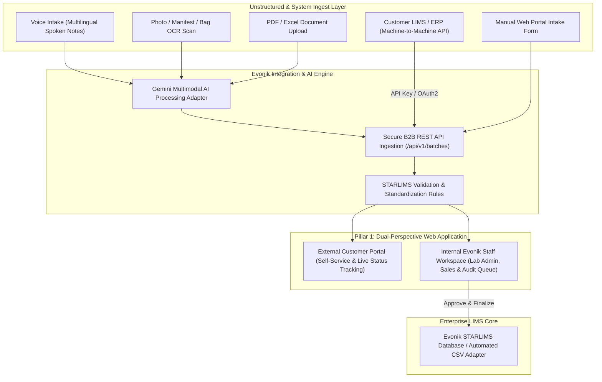

# Evonik Sample Registration Portal: Enterprise Architecture & MNC Implementation Strategy

## 1. Executive Summary & Ecosystem Vision

The goal of the **Evonik Sample Registration Portal** is to modernize, streamline, and automate how agricultural, feed, and chemical samples are registered into Evonik's laboratory ecosystem. 

Historically, sample registration relies on manual spreadsheet entries, email requests, paper packing slips, or customized local STARLIMS imports. This strategy unifies all registration channels into a **single, secure, AI-powered digital entry point**.

---

## 2. Comprehensive Analysis of the 3 Pillars

### Pillar 1: Dual-Perspective Web Application (Customers vs. Evonik Staff)
A unified web platform featuring **Role-Based Access Control (RBAC)** to serve two distinct user profiles:
- **External Customer Portal (Self-Service)**:
  - Simplified registration UI for feed mills, farms, and food producers.
  - Real-time batch lifecycle tracking (`Draft` $\rightarrow$ `Submitted` $\rightarrow$ `Received at Lab` $\rightarrow$ `In Testing` $\rightarrow$ `Completed`).
  - Digital manifest printing with scannable QR codes for sample shipping boxes.
  - Certificate of Analysis (CoA) archive and historical result downloads.
- **Evonik Staff Workspace (Internal Lab Operations, Sales & Admin)**:
  - Centralized audit queue for lab officers to inspect, approve, or adjust incoming batches.
  - Automated sample barcode assignment matching STARLIMS rules.
  - SLA performance monitoring, regional lab routing, and workload analytics.

### Pillar 2: Open B2B Customer LIMS API (Machine-to-Machine Ingestion)
An open, standardized RESTful API enabling enterprise customer systems (e.g., LabWare, Thermo Fisher LIMS, SAP, Custom ERPs) to transmit sample batches programmatically without manual UI interaction.
- **Standards-Based Ingestion**: Standardized JSON endpoints (`/api/v1/external/batches`).
- **Webhooks Integration**: Real-time push notifications sent directly back to customer LIMS endpoints when tests finish.
- **Multi-Format Adapters**: Support for JSON payloads, CSV batch uploads, and legacy XML/EDI mapping.

### Pillar 3: AI Multimodal Processing Layer ("The Intelligent Adapter")
The intelligent bridge transforming unstructured inputs (voice recordings, sample bag photos, handwritten packing slips) into structured STARLIMS-ready JSON payloads.
- **Multilingual Voice Intake**: Transcribes and translates regional spoken dialects into clean English sample descriptions.
- **Vision OCR Intake**: Scans paper forms, shipping labels, and sample bag tags.
- **Rule Normalization**: Automatically maps customer material terms to standardized upper-case codes (e.g., `"broiler feed"` $\rightarrow$ `BROILER`, `"sbm"` $\rightarrow$ `SOYBEAN_MEAL`).

---

## 3. Phase Roadmap & MNC Environment Challenges

Operating within a **Multinational Corporation (MNC)** environment introduces strict IT governance, regulatory constraints, regional data privacy laws, legacy software dependencies, and complex cross-border workflows. Below is a breakdown of technical and operational challenges across each phase.

### Phase 1: Multimodal AI Processing Tool (Current Foundation)
**Focus**: Voice transcription, photo OCR scanning, and intelligent text extraction into STARLIMS JSON format.

#### **MNC Challenges**:
1. **Cloud AI Governance & Data Privacy (GDPR / PII)**:
   - Voice recordings or photo manifests may accidentally capture operator names, personal phone numbers, or proprietary customer formulas.
   - Sending audio/images to public Cloud LLM APIs (e.g. Google Gemini, OpenAI) must comply with Evonik Data Protection policies, requiring Enterprise API agreements with zero-data-retention guarantees.
2. **Regional Accent & Noise Variability**:
   - Lab environments are noisy (machinery, background hums), and users span diverse linguistic backgrounds (e.g., Bahasa Indonesia, Thai, Spanish, German, Mandarin).
   - Audio preprocessing (noise suppression) and prompt-level context hints are critical to prevent mistranscriptions of technical test acronyms (e.g., mistaking `"TDF"` for `"TDP"`).
3. **AI Hallucination & Validation Safeguards**:
   - Generative AI models can occasionally misread numbers (e.g. reading sample ID `1001` as `1007`).
   - Strict schema validation and human-in-the-loop audit thresholds must verify AI output before committing data to production LIMS.

---

### Phase 2: Open B2B Customer LIMS API (Machine-to-Machine)
**Focus**: Public REST API, API key management, customer IT onboarding, and STARLIMS payload standardization.

#### **MNC Challenges**:
1. **Enterprise Perimeter Security & Network Isolation**:
   - MNC firewalls, DMZ configurations, and API Gateways (e.g., MuleSoft, Apigee, Kong) require rigorous security reviews before exposing public API endpoints.
   - Solution requires OAuth2 Client Credentials grant flow (`client_id` + `client_secret`) or Mutual TLS (mTLS) for enterprise B2B connections.
2. **Disparate Customer Data Standards**:
   - Enterprise customers use different LIMS platforms with non-standard naming conventions (e.g., Customer A calls corn `"Maize Feed"`, Customer B calls it `"Corn Gluten Meal #2"`).
   - The API must feature a robust terminology translation layer to map customer codes to Evonik STARLIMS standards seamlessly.
3. **SLA, Rate Limiting & High Availability**:
   - Enterprise customers relying on API integrations demand high uptime (99.9% SLA).
   - API rate limiting, DDoS protection, and asynchronous task queues (e.g. Celery / Redis) are necessary to handle peak submission hours across global time zones.

---

### Phase 3: Dual RBAC Web Application (Customer & Evonik Portals)
**Focus**: Multi-tenant customer web portal, internal Evonik admin workspace, role-based access control, and status tracking.

#### **MNC Challenges**:
1. **Single Sign-On (SSO) & Identity Federation**:
   - Evonik staff must authenticate via Evonik Single Sign-On (Azure AD / Microsoft Entra ID) with Multi-Factor Authentication (MFA).
   - External customers require a frictionless self-registration/invitation flow (e.g. Auth0, B2C Entra ID, or email magic links).
2. **Cross-Border Data Residency & Compliance**:
   - Regulations such as EU GDPR, China PDSL/CSL, and US data protection frameworks dictate where customer data can be hosted and processed.
   - Hosting architecture must ensure regional compliance (e.g., EU customer data stored on European cloud instances).
3. **Change Management & Global User Adoption**:
   - Internal lab personnel across different global facilities may be accustomed to legacy local registration methods.
   - UI must be intuitive, fast, and available in multiple languages with minimal training required.

---

### Phase 4: STARLIMS Core Integration & Global Rollout
**Focus**: Direct automated database sync with Evonik's internal STARLIMS database and ERP instances.

#### **MNC Challenges**:
1. **STARLIMS Customization Mismatches Across Sites**:
   - Different regional Evonik laboratories may run different STARLIMS versions, custom schemas, or localized workflows.
   - The integration adapter must decouple the core API from site-specific LIMS schemas using modular middleware adapters.
2. **Zero-Downtime Synchronization & Offline Resiliency**:
   - Network maintenance or STARLIMS downtime should never block customer submissions.
   - System requires a transaction queue mechanism (store-and-forward pattern) to hold submitted batches in a secure staging queue and auto-retry insertion when LIMS connection restores.

---

## 4. Summary Matrix: Risk & Mitigation Architecture

| Governance Pillar | MNC Risk Factor | Enterprise Mitigation Strategy |
| :--- | :--- | :--- |
| **Data Protection** | Exposure of PII or proprietary customer formulas to cloud services. | Implement PII redaction filters before sending text/audio to AI; utilize Enterprise Cloud LLM instances with zero-data-logging agreements. |
| **API Security** | Unauthorized access or API abuse by third parties. | Enforce OAuth2 Client Credentials, API key rotation policies, rate limiting, and Web Application Firewall (WAF) rules. |
| **Multi-Tenancy** | Customer A viewing Customer B’s sample data. | Implement strict Row-Level Security (RLS) in backend queries scoped by authenticated Tenant/Customer ID. |
| **LIMS Sync Reliability** | STARLIMS network outages causing registration failures. | Use an asynchronous message broker (Redis / RabbitMQ) with automatic retry and error escalation queues. |
| **AI Reliability** | AI extraction misinterpreting handwritten or spoken numbers. | Enforce strict Pydantic field validation rules and flag low-confidence extractions for manual review by Evonik lab staff. |

---

## 5. Recommended Immediate Next Steps

1. **Review & Align**: Review this document with project stakeholders to align on strategic priorities.
2. **API Endpoint Definition (Phase 2 Preparation)**: Finalize OpenAPI specification (`/api/v1/external/batches`) matching Evonik's STARLIMS CSV import parameters.
3. **Identity Integration Architecture**: Engage Evonik IT / Identity teams to define Entra ID SSO integration for internal staff and OAuth2 for external customers.
