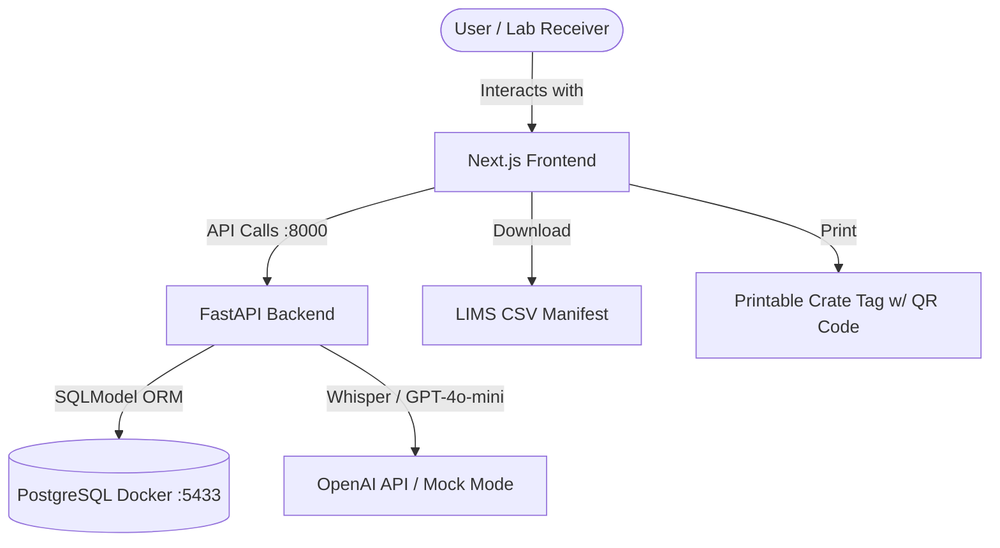

# Lab Sample Intake Portal - Quickstart & User Guide

Welcome to the **Lab Sample Intake Portal**! This tool is designed to streamline sample registration for analytical laboratories by leveraging AI extraction (audio and photos), real-time validation checks, and automatic LIMS export formatting.

---

## 🏗️ System Architecture

The portal is built as a decoupled web application comprising:



### Component Details
1. **Frontend (`/frontend`)**: A Next.js Web App styled with Tailwind CSS and styled glassmorphism. It uses [lucide-react](https://lucide.dev/) for iconography, [qrcode.react](https://github.com/zpao/qrcode.react) for receiving station tags, and a spreadsheet grid for manual sample entry.
2. **Backend (`/backend`)**: A FastAPI Python application using [SQLModel](https://sqlmodel.tiangolo.com/) (SQLAlchemy + Pydantic) to interface with PostgreSQL.
3. **Database**: A PostgreSQL 15 instance running in Docker mapping host port `5433` to standard port `5432`.
4. **AI Services**: Powered by `openai` (Whisper for audio transcripts, GPT-4o-mini for structured JSON extraction and vision OCR). If no API key is specified, it gracefully degrades to **Mock Mode** using pre-configured mock data.

---

## 🛠️ Prerequisites

Before launching the portal, ensure you have the following installed on your system:

*   **Node.js** (v18 or newer)
*   **Python** (3.10 or newer)
*   **Docker Desktop** (running)

---

## 🚀 Getting Started

### 1. Launching the App
We have provided a unified startup script `start.bat` in the root folder. Running this batch file does the following:
*   Starts/creates the `lab-postgres` Docker container on port `5433`.
*   Launches the FastAPI backend on `http://localhost:8000`.
*   Launches the Next.js frontend development server on `http://localhost:3000`.

To start:
1. Double-click [start.bat](file:///d:/Data/AI-projects/sample-registration-portal/start.bat) (or run it via command line).
2. Wait for the browser to launch or visit: `http://localhost:3000`

### 2. (Optional) Configuring OpenAI API Key
By default, the application runs in **Mock Mode** because the `OPENAI_API_KEY` in the environment is blank.
*   **Mock Mode**: You can test the audio transcriber and OCR scanner using any dummy audio/image file, and the backend will return pre-populated mock samples (e.g., broiler feed, swine feed) for demonstration purposes.
*   **Real AI Mode**: To use actual AI extraction, edit the [backend/.env](file:///d:/Data/AI-projects/sample-registration-portal/backend/.env) file:
    ```env
    OPENAI_API_KEY=your_actual_openai_api_key_here
    ```
    Then restart the backend service.

---

## 📋 Step-by-Step Usage Flow

Here is how to register a sample batch using the portal:

### Step 1: Set Submitter Name
On the top right of the dashboard, enter the submitter's name (e.g., *Smith Farms Ltd*). This maps the intake batch to a specific customer profile in the database.

### Step 2: Input Sample Data
You can populate the interactive worksheet grid in three ways:

*   🎙️ **Voice Intake**: Click **Record** and speak naturally (e.g., *"We need to register broiler chicken feed samples. Test them for Total Amino Acids and NIR."*). Stop the recording to parse it. Alternatively, upload an audio file.
*   📸 **Manifest Photo Scanner**: Upload an image of an intake form, handwritten list, or labels. The system uses GPT Vision to parse names, descriptions, and requested tests.
*   ⌨️ **Manual Entry**: Directly add rows using the **Add Sample** button in the grid and edit descriptions and check/uncheck test boxes.

### Step 3: Review and Standardize Draft
The worksheet grid acts as a draft sandbox. The backend allows you to save temporary drafts even if they have validation errors:
1. Make edits to descriptions, material classifications (e.g., BROILER, PIG, FISH, RUMINANT, PET, OTHER), and tests.
2. Click **Save & Proceed to Review**. This saves the batch state and navigates you to `http://localhost:3000/review?batch_id=<id>`.

### Step 4: Run Audits and Enforce Constraints
On the **Review & Confirm** page, the portal runs a strict validation checklist before allowing submission:
*   A valid submitter name must be provided.
*   The batch must contain at least 1 sample.
*   All sample descriptions must be filled.
*   **At least 1 test** must be requested per sample (from *Total AA, Supp AA, NIR, Trp, GAA*).

If any sample fails, the system highlights the row with validation errors. You can correct them directly in the grid.

### Step 5: Finalize and Submit to LIMS
Once everything is valid, click **Confirm & Submit to LIMS**. This does two things:
1. Marks the batch status as `submitted` in PostgreSQL, preventing further edits.
2. Generates a shipping crate manifest with a unique QR Code.

### Step 6: Print & Export
On the manifest screen:
*   **Download LIMS CSV**: Downloads a clean CSV formatted for immediate ingestion by standard Laboratory Information Management Systems.
*   **Print Manifest**: Opens the print dialog. The page is styled using print media queries to render a clean, standard paper label (with the QR code) that you can tape to the shipping box/crate. When receiving officers scan the QR code, the entire digital record is pulled instantly.
